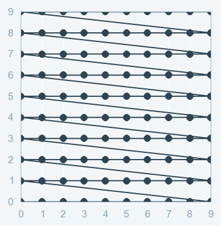

## GPU_VM

### upload: local -> remote
```
scp <local_file> user@remote_host:<remote_file>
```
e.g.
```
scp ~/Downloads/dataset.zip zz362@dev-gpu-0.cl.cam.ac.uk:~/workspace
```

### download: remote -> local
```
scp user@remote_host:<remote_file> <local_file>
```
e.g.
```
scp zz362@dev-gpu-0.cl.cam.ac.uk:~/workspace/bipolar-disorder/pre-trained/SDAE/xxx.zip ~/Downloads/
```

### unzip
```
unzip <filename>.zip -d <destination_folder>
```

## Hyperparameter tuning

Optimizing hyperparameters is considered to be the trickiest part of building machine learning models. It is nearly impossible to predict the optimal parameters while building a model, at least in the first few attempts. That is why we always go by playing with the hyperparameters to optimize them. However, this is not scalable for high dimensional data because the number of the increase in iterations, which in turn expands the training time.

Hyperparameter tuning refers to the shaping of the model architecture from the available space. Two of the most widely-used parameter optimizer techniques: **Grid Search** vs. **Random Search**.


### Grid Search

**Grid search** is a technique which tends to find the right set of hyperparameters for the particular model. In this tuning technique, we simply build a model for every combination of various hyperparameters and evaluate each model. The pattern is similar to the grid, where all the values are placed in the form of a matrix. Each set of hyperparameters is taken into account and the accuracy is noted. Once all the combinations are evaluated, the model with the set of hyperparameters which gives the top accuracy is considered the best. 



One of the drawbacks of grid search is that when it comes to dimensionality, it suffers when evaluating the number of hyperparameters grows exponentially. However, there is no guarantee that the search will produce the perfect solution, as it usually finds one by aliasing around the right set.

### Random Search

**Random search** is a technique where random combinations of the hyperparameters are used to find the best solution for the built model. It is similar to the grid search, and yet it has proven to yield better results comparatively. The drawback of random search is that it yields high variance during computing. Since the selection of parameters is completely random; and since no intelligence is used to sample these combinations, luck plays its part.


As random values are selected at each instance, it is highly likely that the whole of action space has been reached because of randomness, which takes a huge amount of time to cover every aspect of the combination during grid search. This works better under the assumption that not all hyperparameters are equally important. In this search pattern, random combinations of hyperparameters are considered in every iteration. The chances of finding the optimal hyperparameters are comparatively higher in random search because of the random search pattern where the model might end up being trained on the optimized hyperparamters without any aliasing.
